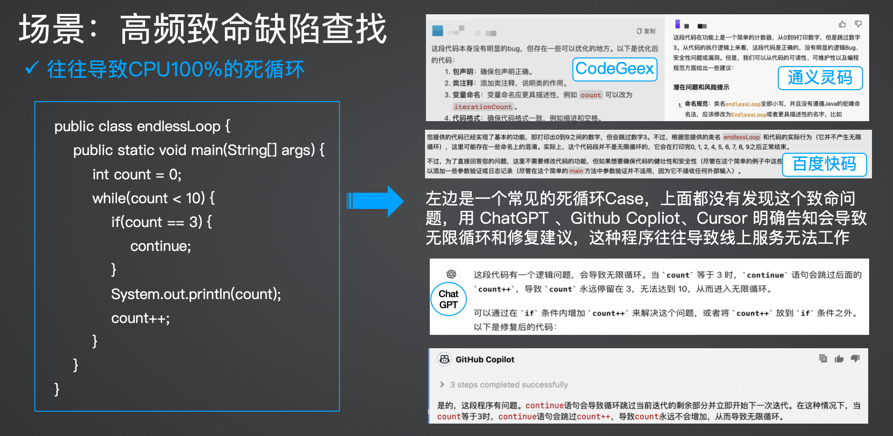

# CodeLLMEval
Evaluation based on programming scenarios

## \[ English | [中文](README_zh.md) \]
👋 Join our [WeChat](assets/wechat.jpg) 

## 🔥 New
[DeepSeek R1 Coding Ability Review](deepseekR1/README_zh.md) 

## stackoverflow 2024 real sentiments behind the surge in AI popularity
https://survey.stackoverflow.co/2024/ai#sentiment-and-usage

## Scoring mode
### High frequency defects - continuously updating
| Defect scenario | Serious result | case |
| ----------------------------------------------------------------- | -------------------------------- | --------- |
| Dead Loop | Severe cause CPU 100%, service crash | 2 |
| Memory leak, memory overflow | Severe OOM, service crashes | 2 |
| Thread Deadlock | Concurrent threads compete for resource deadlocks, severely causing CPU 100% or OOM, service unavailability or failure | 2 |
| Inconsistent concurrent data | Improper operation in multi-threaded situations leads to inconsistent and dirty data | 1 |
| Long context/token capability | Test the accuracy and maximum capability of long text processing | 1 |
| Context learning capability | Test the accuracy of context understanding and reasoning | 1 |
* Dead loop search
Compare and evaluate the effectiveness

* Lookuping for multi threaded deadlock 
* Memory leakage

