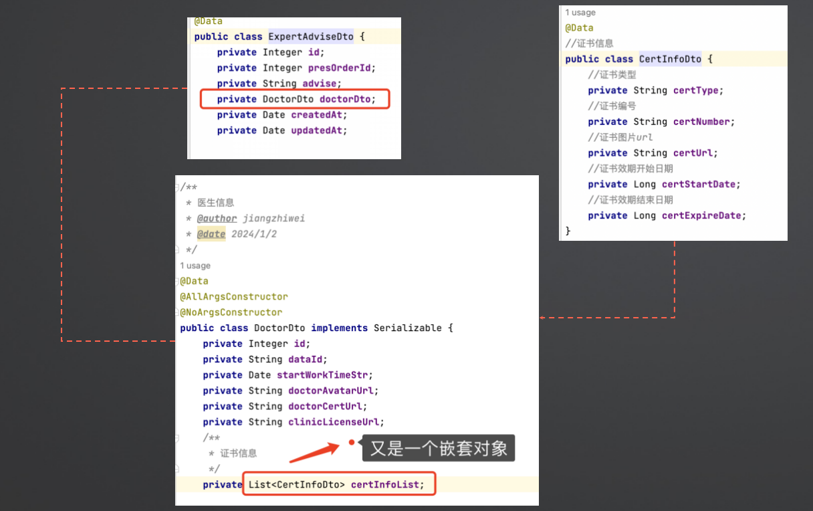

# 大模型上下文理解能力
从底层原理解剖大模型的上下文理解和推理能力

## API 文档生成
通过代码Token，观察生成的API文档，是否符合需求，是否理解准确
主要考察维度：
1. 是否理解需求业务
2. 是否入参、出参理解准确
3. 复杂的嵌套入参、出参是否理解准确
> **重要说明：** 
> 特别是第3点，重点考察大模型在以下方面的能力：
> - 理解函数的嵌套入参和出参结构
> - 分析代码的上下文结构
> - 从上下文中检索有用信息
> - 进行逻辑推理

### 医疗口腔服务的API文档生成案例
具体函数方法
```
@Slf4j
@RestController
@RequestMapping("/api/v1/advice")
public class AdviseController  {
    @Autowired
    AdviseService adviseService;

    @PostMapping("/submitExpertAdvise")
    public Result<Integer> submitExpertAdvise(@RequestBody ExpertAdviseDto expertAdviseDto){
        Integer expertAdviseId = adviseService.addOrUpdateExpertAdvise(expertAdviseDto);
        return Result.succ(expertAdviseId);
    }
}
```
具体入参
```
public class ExpertAdviseDto {
    private Integer id;
    private Integer presOrderId;
    private String advise;
    private DoctorDto doctorDto;
    private Date createdAt;
    private Date updatedAt;
}
```
 * 入参里面子参数 DoctorDto
```
package com.next4.ai.dto;

import com.fasterxml.jackson.annotation.JsonIgnore;
import lombok.AllArgsConstructor;
import lombok.Data;
import lombok.NoArgsConstructor;

import java.io.Serializable;
import java.util.Date;
import java.util.List;

/**
 * 医生信息
 * @author jiangzhiwei
 * @date 2024/1/2
 */
@Data
@AllArgsConstructor
@NoArgsConstructor
public class DoctorDto implements Serializable {
    private Integer id;
    private String dataId;
    private Date startWorkTimeStr;
    private String doctorAvatarUrl;
    private String doctorCertUrl;
    private String clinicLicenseUrl;
    /**
     * 所属诊所
     */
    private String clinicCode;

    /**
     * 所属诊所
     */
    private String clinicName;

    /**
     * 医生账号
     */
    private String userName;

    /**
     * 密码
     */
    @JsonIgnore
    private String password;

    /**
     * 加密盐
     */
    @JsonIgnore
    private String salt;

    /**
     * 中文名
     */
    private String realName;


    /**
     * 诊所ID
     */
    private Integer clinicId;

    /**
     * 第三方医生ID
     */
    private String thirdPartyDoctorId;

    /**
     * 从医开始时间
     */
    private Long startWorkTime;

    /**
     * 证书编号
     */
    private String certNumber;

    /**
     * C端注册时填写的诊所名称
     */
    private String registerClinicName;

    /**
     * 性别
     */
    private Byte sex;

    /**
     * 邮箱
     */
    private String email;

    /**
     * 手机
     */
    private String mobile;

    /**
     * 微信ID
     */
    private String openid;
    private String openidLs;

    private String unionId;

    /**
     * 出生日期
     */
    private Integer birthDate;
    private Date birthDateStr;

    /**
     * 用户头像
     */
    private String logo;

    /**
     * 注册省份
     */
    private String registerProvince;

    /**
     * 注册城市
     */
    private String registerCity;

    /**
     * 注册县区
     */
    private String registerArea;

    /**
     * 注册详细地址
     */
    private String registerAddress;

    /**
     * 二维码状态
     */
    private Byte qrCodeStatus;

    /**
     * 审核状态
     */
    private Byte checkStatus;

    /**
     * 状态
     */
    private Byte status;

    /**
     * 资格证书
     */
    private String certUrl;

    /**
     * 是否在线
     */
    private Byte isOnline;

    /**
     * 登录版本号（防止多人同时用一个账号）
     */
    private Integer loginVersion;

    /**
     * 最后登录时间
     */
    private Integer lastLoginTime;

    /**
     * 创建用户ID
     */
    private Integer createdUserId;

    /**
     * 创建用户名
     */
    private String createdUserName;

    /**
     * 创建时间
     */
    private Integer createdAt;

    /**
     * 最后修改时间
     */
    private Integer updatedAt;

    /**
     * 软删除时间
     */
    private Integer deletedAt;

    /**
     * TOKEN
     */
    private String token;

    /**
     * TOKEN效期
     */
    private Integer tokenExpireTime;

    private static final long serialVersionUID = 1L;


    /**
     * 证书信息
     */
    private String certInfos;
    
    /**
     * 证书信息
     */
    private List<CertInfoDto> certInfoList;

    /**
     * 医生背景
     */
    private String doctorBackground;

    /**
     * 医生背景其他内容
     */
    private String doctorBackgroundOther;

    /**
     * 毕业院校
     */
    private String graduateSchool;

    /**
     * 最高学历
     */
    private String highestEducation;

    /**
     * 最高学历其他内容
     */
    private String highestEducationOther;

    /**
     * 正畸量
     */
    private String orthodonticsNum;

    /**
     * 正畸结束cases
     */
    private String orthodonticsEndCases;

    /**
      * 医生偏好
     */
    private String preferences;
    
    /**
       * 医生偏好
     */
    private List<String> preferenceList;
    
}
```
 * 子参数再嵌套的二级子参数 CertInfoDto
```
@Data
@ApiModel("证书信息")
public class CertInfoDto {
    @ApiModelProperty("证书类型")
    private String certType;
    @ApiModelProperty("证书编号")
    private String certNumber;
    @ApiModelProperty("证书图片url")
    private String certUrl;
    @ApiModelProperty("证书效期开始日期")
    private Long certStartDate;
    @ApiModelProperty("证书效期结束日期")
    private Long certExpireDate;
}
```
 * 参数的嵌套结构


### 测试结果
 * 输入的代码提示词  
```
生成submitExpertAdvise 方法的完整 API 文档：带上入参、出参所有参数 的详细中文介绍， 给出完整示例， 格式markdown，给前端调用
```
 * 参数完全错误，0分：通义灵码、百度问心、智谱、MarsCode、Cursor


 
 
* 参数完全正确，复杂子嵌套也是完整的 100分：Github Copilot


* 手动优化提示词和补充上下文，基本让所有AI编程工具勉强生成可用API 
