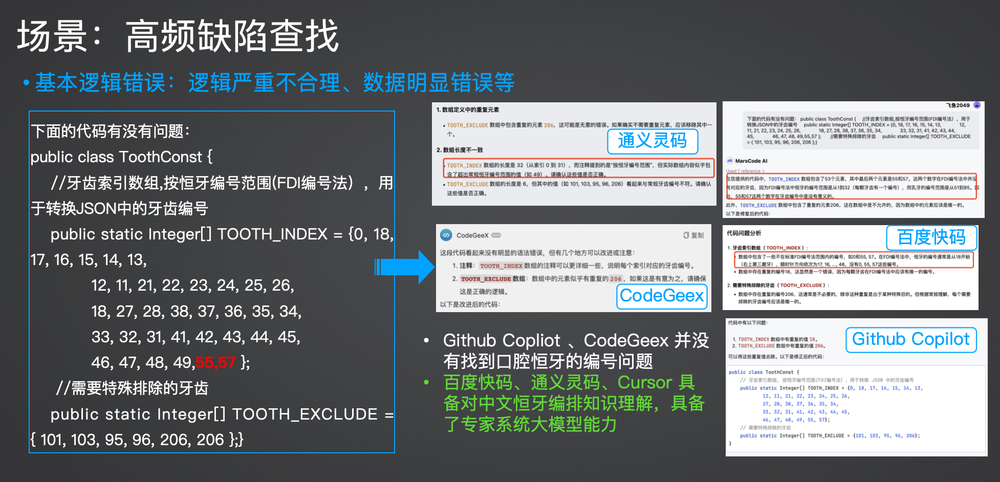
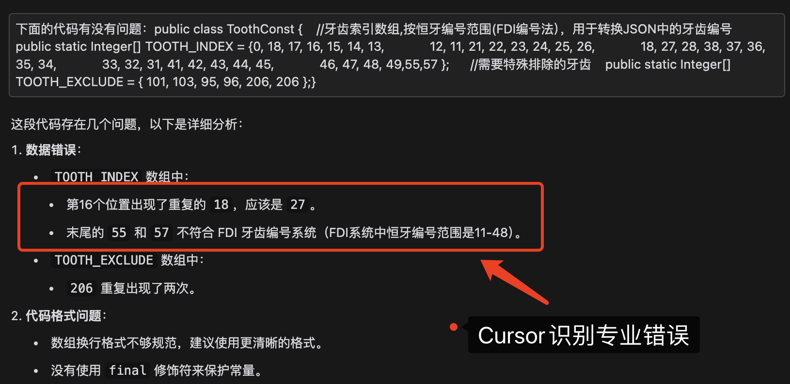
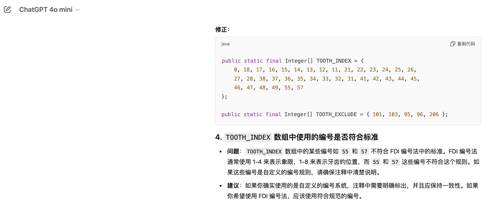

# 大模型中文专业知识能力
从大模型的预训练原理，考察通用大模型大数据联网的RAG能力，具备更实时、更丰富的专业知识。对比搜索引擎出生的百度、全网数据训练的OpenAI、Claude等

## 编程工具查找数据缺陷
利用医疗专业知识储备，编程工具查找业务缺陷
主要考察维度：
1. 大模型数据储备能力
2. 大模型专家系统逻辑能力
> **重要说明：** 
> 重点考察大模型在以下方面的能力：
> - 知识储备，特别是中文领域储备
> - 专业领域业务推理能力

### 医疗案例
业务场景描述
> - 通过编程大模型，快速识别口腔中恒牙编号的简单逻辑错误
提示词描述
```
下面的代码有没有问题：
public class ToothConst {
    //牙齿索引数组,按恒牙编号范围(FDI编号法），用于转换JSON中的牙齿编号
    public static Integer[] TOOTH_INDEX = {0, 18, 17, 16, 15, 14, 13, 
            12, 11, 21, 22, 23, 24, 25, 26, 
            18, 27, 28, 38, 37, 36, 35, 34, 
            33, 32, 31, 41, 42, 43, 44, 45, 
            46, 47, 48, 49,55,57 }; 
     //需要特殊排除的牙齿
    public static Integer[] TOOTH_EXCLUDE = { 101, 103, 95, 96, 206, 206 };}
```

### 测试结果 

 * 中文专业知识储备：百度Comate、通义灵码、MarsCode、Cursor，Github Copilot和CodeGeex不具备这个能力


 * 从这个例子还可以看出：Github Copilot 并不等于 ChatGPT的能力
 

### 总结
 * 通用大模型肯定比垂直代码大模型知识储备和专业逻辑能力要强
 * 给到一个启发，Cursor 和 Github Copilot对比，本质是 ChatGPT对比Github Copilot