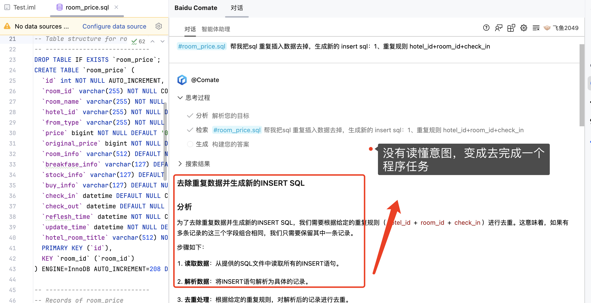

# 大模型长文本\长Token 处理能力
从大模型的Token的输入和输入原理解剖编程大模型的Token处理能力

## 数据修正
通过数据修改的描述，修改长Token的数据文件，观察编程大模型处理能力
主要考察维度：
1. 是否理解需求业务
2. 是否能完整输出结果
3. 结果是否正确
> **重要说明：** 
> 重点考察大模型在以下方面的能力：
> - 准确分析代码的上下文结构
> - 长Token的能力
> - 异常兜底的能力

### 旅游酒店的案例
业务场景描述
> - 简单进行酒店数据的ETL清洗
> - 特定去重酒店冗余数据，指定数据文件
> - 可以作为通用测评
提示词描述
```
帮我把sql 重复插入数据去掉，生成新的 insert sql：1、重复规则 hotel_id+room_id+check_in
```
对应的SQL表描述和数据示例
```
CREATE TABLE `room_price` (
  `id` int NOT NULL AUTO_INCREMENT,
  `room_id` varchar(255) NOT NULL COMMENT '房间唯一id',
  `room_name` varchar(255) NOT NULL DEFAULT '' COMMENT '房间名称',
  `hotel_id` varchar(255) NOT NULL DEFAULT '0' COMMENT '酒店ID',
  `from_type` varchar(255) NOT NULL COMMENT '来源，airbnb、qunar、ctrip、taobao',
  `price` bigint NOT NULL DEFAULT '0' COMMENT '真实价格',
  `original_price` bigint NOT NULL DEFAULT '0' COMMENT '原价',
  `room_info` varchar(512) DEFAULT NULL COMMENT '房间描述',
  `breakfase_info` varchar(127) DEFAULT NULL COMMENT '有用早餐',
  `stock_info` varchar(127) DEFAULT NULL COMMENT '房间库存',
  `buy_info` varchar(127) DEFAULT NULL COMMENT '销售情况：预订、售完、领券订',
  `check_in` datetime DEFAULT NULL COMMENT '入住时间',
  `check_out` datetime DEFAULT NULL COMMENT '退房时间',
  `reflesh_time` datetime NOT NULL COMMENT '价格更新时间',
  `update_time` datetime NOT NULL DEFAULT CURRENT_TIMESTAMP ON UPDATE CURRENT_TIMESTAMP COMMENT '记录时间',
  `hotel_room_title` varchar(512) NOT NULL DEFAULT '',
  PRIMARY KEY (`id`),
  KEY `room_id` (`room_id`)
) ENGINE=InnoDB AUTO_INCREMENT=208 DEFAULT CHARSET=utf8mb4 COLLATE=utf8mb4_0900_ai_ci COMMENT='酒店房间价格明细表';
-- ----------------------------
-- Records of room_price
-- ----------------------------
BEGIN;
INSERT INTO `room_price` VALUES (1, '10480597_0', '未闻·欢喜大床房', '10480597', 'ctrip', 404, 578, '1张1.8米大床|32-40m²', '无早餐', '仅剩1间', '可售', '2024-04-10 00:00:00', '2024-04-11 00:00:00', '2024-04-09 17:19:18', '2024-04-09 17:19:18', '未闻小筑（西湖灵隐店）民宿:未闻·欢喜大床房');
INSERT INTO `room_price` VALUES (2, '10480597_1', '精致庭院大床房', '10480597', 'ctrip', 428, 614, '1张1.8米大床|40m²|有窗', '无早餐', '仅剩3间', '可售', '2024-04-10 00:00:00', '2024-04-11 00:00:00', '2024-04-09 17:19:18', '2024-04-09 17:19:18', '未闻小筑（西湖灵隐店）民宿:精致庭院大床房');
INSERT INTO `room_price` VALUES (3, '10480597_2', '舒适庭院大床房', '10480597', 'ctrip', 438, 626, '1张1.8米大床|35m²|有窗|', '无早餐', '仅剩2间', '可售', '2024-04-10 00:00:00', '2024-04-11 00:00:00', '2024-04-09 17:19:18', '2024-04-09 17:19:18', '未闻小筑（西湖灵隐店）民宿:舒适庭院大床房');
......
END;
 * 输入的代码提示词  
```
### 测试结果 

 * 语义理解错误，0分：百度Comate、智谱CodeGeex、MarsCode、Cursor

* 语义理解正确，处理长文本/长Token上下文时，任务没有最终完成,60分：通义灵码、Github Copilot


* 完整完成了任务，有非常好diff体验


### 总结
 * Cursor 虽然依赖第三方大模型，但是在复杂的长文本任务时，显得游刃有余，速度实测比较快
 * 给到一个启发，产品上刻意限制Token长度会导致很多编程任务完成不了