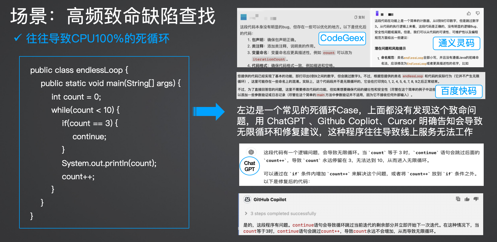

# R1

## 创新点
 - 1、deekseek 预训练  强化学习 RL 提高推理效率非常高：采用GRPO，优化过去 RLHF- PPO，MCTS 走不通
 - 2、Long COT ，with thousands of long Chain-of-Thought (CoT) examples ,替代过去大量的SFT训练, deepseek 的 Long COT体现在 think 标签中，可以很清晰理解模型的COT过程 
 - 3、蒸馏对小模型逻辑推理明显增强

 > * 1、3 被国内外技术认证
 > * https://github.com/deepseek-ai/DeepSeek-R1/blob/main/DeepSeek_R1.pdf


# V3
 - 1、FP8 Training  比 fp16、fp32 大大节约空间和运算速度 
 > Pre-Training: Towards Ultimate Training Efficiency
We design an FP8 mixed precision training framework and, for the first time, validate the feasibility and effectiveness of FP8 training on an extremely large-scale model
 - 2、用 Long Cot 模式蒸馏获取(更好的)推理能力 
Post-Training: Knowledge Distillation from DeepSeek-R1
We introduce an innovative methodology to distill reasoning capabilities from the longChain-of-Thought (CoT) model
 - 3、更经济的模型训练，优化Attention的 MLA 和 Moe 的DeepSeekMoE
 > * Architecture
 > * We first introduce the basic architecture of DeepSeek-V3, featured by Multi-head Latent Attention (MLA) (DeepSeek-AI, 2024c) for efficient inference and DeepSeekMoE (Dai et al., 2024) for economical training

# 编码的逻辑推理能力测评
 * 基于开源的 Deepseek R1，两个参数版本 8b、32b
 * 基于二个编程能力维度测评：1、知识储备 Knowledge 2、推理能力 Reasoning 3、上下文理解能力
## 测评效果
### 致命缺陷：Deepseek v2、大部分编程工具都没有正确识别程序的死循环

 * 提示词
```
下面代码有没有问题：
public class endlessLoop {
    public static void main(String[] args) {
        int count = 0;
        while(count < 10) {
            if(count == 3) {
                continue;
            }
            System.out.println(count);
            count++;
        }
    }
}
``` 
#### 8b
deepseek进入Long COT长思维链过程，一开始没有发现缺陷，它开始了反思

通过反思推导，最终找到致命缺陷


#### 32b
 * 很诡异的，32b模型第一次并没有识别到这个错误
 
 * 进过漫长的COT的thinking，最终发现这个问题，幻觉比较严重
 
### 知识储备：专业医疗知识领域业务逻辑，考验不同参数下模型储备能力
 * 提示词
```
下面的代码有没有问题：
public class ToothConst {
    //牙齿索引数组,按恒牙编号范围(FDI编号法），用于转换JSON中的牙齿编号
    public static Integer[] TOOTH_INDEX = {0, 18, 17, 16, 15, 14, 13,
            12, 11, 21, 22, 23, 24, 25, 26,
            18, 27, 28, 38, 37, 36, 35, 34,
            33, 32, 31, 41, 42, 43, 44, 45,
            46, 47, 48, 49,55,57 };
     //需要特殊排除的牙齿
    public static Integer[] TOOTH_EXCLUDE = { 101, 103, 95, 96, 206, 206 };}
``` 
#### 8b
 * 结果，对比其它编程模型，8b并没有找到错误原因

#### 32b
 * 但是如果我们采用32b模型，就能识别出这段代码对牙齿数据错误
  

### 数据建模-长上下文
 * 提示词：真实产品文档生成表设计
```
视频点播教学系统，设计表，产品需求如下：
视频管理：视频列表、视频搜索、上下架视频、新增视频、上传视频
课程管理：课程列表、课程搜索、上下架课程、新增课程、课程关联视频、课程分类、一个课程会有一个或者多个视频
分类管理：新增分类、新增一级分类、一级分类下新增二级分类、分类排序、删除分类
视频数据记录表：每个用户观看视频最大时间，观看视频的完成比，记录每个用户的id、name
视频统计信息表：每个视频观看人数、观看次数、观看完成比(每个用户观看视频95%表示视频观看完成)
每个表都有如下的几个字段:   
`remarks` varchar(255) CHARACTER SET utf8mb4 COLLATE utf8mb4_bin DEFAULT NULL COMMENT '备注',   
`create_id` bigint NOT NULL DEFAULT '0' COMMENT '创建人id',   `update_id` bigint NOT NULL DEFAULT '0' COMMENT '更新人id',   `create_time` datetime NOT NULL COMMENT '创建时间',   
`update_time` datetime NOT NULL DEFAULT CURRENT_TIMESTAMP ON UPDATE CURRENT_TIMESTAMP COMMENT '更新时间', 
返回结果:  表的数量和名字、所有表的所有字段、字段说明的SQL语句
``` 
#### 32b
 * deepseek 设计表不完整，对比常见的编程大模型有差距

 * 对比表现好的编程大模型


## deepseek 编码能力测评简单总结
 * 大家看到通用编码测评打分，水分比较大，并不能真实看出大模型的编码能力

 * 测评打分原理太简单，造假也很容易

 * deepseek 编码能力从真实场景看，处于已有大模型中等水平


